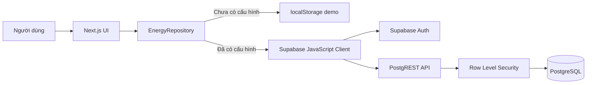
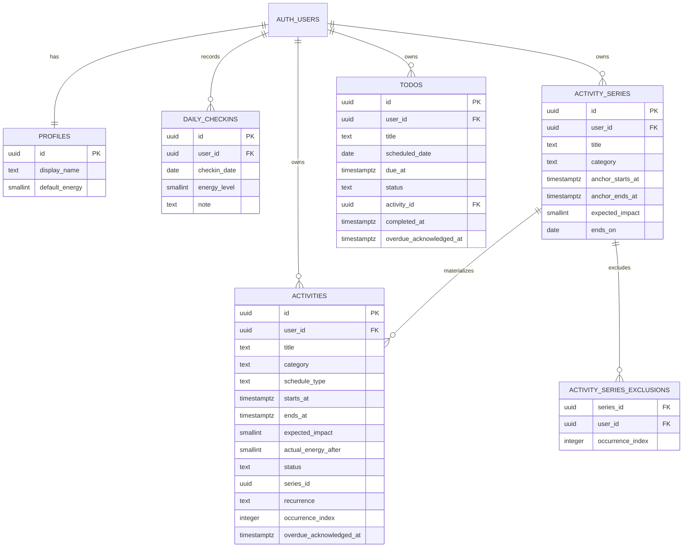
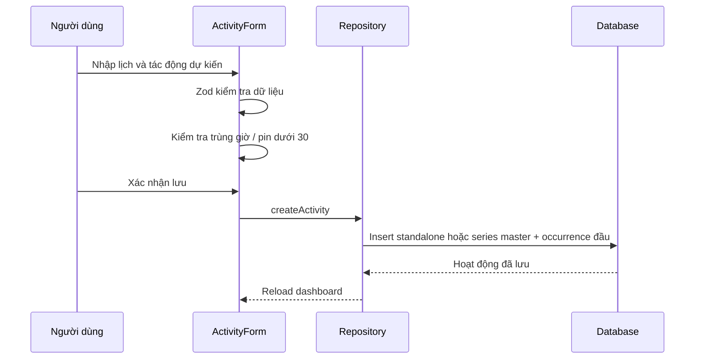

# Kiến trúc — Hôm Nay Thế Nào?

## 1. Bức tranh tổng thể



- **Frontend:** các trang và component Next.js hiển thị lịch, form và năng lượng.
- **Backend/API:** Supabase Auth xử lý tài khoản; PostgREST cung cấp API từ PostgreSQL.
- **Database:** PostgreSQL lưu profile, check-in và hoạt động.
- **Bảo mật:** Row Level Security kiểm tra `auth.uid()` trước mọi thao tác dữ liệu.
- **Demo:** cùng giao diện và nghiệp vụ nhưng lưu trong localStorage thông qua một repository khác.

## 2. Vì sao chọn stack này?

### Next.js

Một project có thể chứa toàn bộ giao diện và logic ứng dụng, deploy trực tiếp lên Vercel. Điều này phù hợp với bài tập một ngày hơn việc tách frontend và backend thành hai server.

### Supabase

Supabase cung cấp PostgreSQL, đăng nhập, API và phân quyền miễn phí. Dự án vẫn thể hiện đầy đủ luồng FE–API–DB mà không phải tự vận hành server riêng.

### Repository pattern

UI chỉ làm việc với `EnergyRepository`, không biết dữ liệu đến từ localStorage hay Supabase. Nhờ đó:

- Có thể xem ứng dụng ngay khi chưa tạo Supabase.
- Logic giao diện không bị lặp.
- Có thể thay nguồn dữ liệu mà ít ảnh hưởng component.

Đánh đổi: demo localStorage không có đồng bộ, giao dịch server hoặc bảo mật đa người dùng.

## 3. Mô hình dữ liệu



### Triển khai schema Supabase

Project Supabase mới phải chạy đầy đủ migration trong SQL Editor theo đúng thứ tự:

1. `supabase/migrations/001_initial_schema.sql` — profile, check-in, hoạt động và RLS nền tảng.
2. `supabase/migrations/002_todos_reminders_calendar.sql` — Todo, overdue acknowledgement, index và RLS bổ sung.

3. `supabase/migrations/003_integer_energy_remove_recovery.sql` — chuyển dữ liệu `recovery` cũ sang `flexible`, giới hạn lịch còn `fixed`/`flexible`, và cho phép mọi mức năng lượng nguyên trong miền hợp lệ.
4. `supabase/migrations/004_link_todos_to_activities.sql` — thêm `todos.activity_id` nullable, FK `on delete set null` và unique partial index theo user/activity.
5. `supabase/migrations/005_activity_series_end.sql` — thêm `activity_series`, exclusions, backfill horizon chuỗi cũ, FK cascade, RLS và unique occurrence conflict target.

Dashboard yêu cầu chạy đúng **001 → 002 → 003 → 004 → 005**. Migration 005 là bắt buộc cho lịch: runtime sẽ báo hướng dẫn rõ ràng thay vì âm thầm quay lại mô hình 12 buổi. Các request profile/check-in vẫn dùng schema nền tảng; Todo tiếp tục có retry riêng khi 002–004 chưa sẵn sàng. Migration 004 không backfill giá trị legacy tuỳ ý: Todo cũ giữ `activity_id = null`; Todo pending được liên kết ở lần chỉnh sửa kế tiếp, còn Todo inactive phải được khôi phục trước để tránh tạo Activity đang chạy cho checklist đã đóng.

### Hợp đồng lịch và năng lượng

- `schedule_type` chỉ có `fixed` và `flexible`. Giá trị legacy `recovery` được demo parser và migration 003 chuẩn hóa thành `flexible` trước khi kiểm tra; nội dung nghỉ ngơi vẫn được biểu diễn bằng `category = rest`.
- `default_energy`, `energy_level` và `actual_energy_after` nhận mọi số nguyên từ 0 đến 100.
- `expected_impact` nhận mọi số nguyên từ -50 đến 50. UI, demo repository và PostgreSQL cùng bảo vệ các miền này; không còn quy tắc chia hết cho 5.
- Demo parser đánh dấu dữ liệu legacy đã chuẩn hóa để ghi lại canonical value, tránh reset hoặc làm mất blob localStorage hợp lệ.

### Lịch lặp

Lịch weekly chỉ hợp lệ với `schedule_type = fixed`. `activity_series` là master giữ template, anchor và `ends_on` (`null` nghĩa là vĩnh viễn); `activities` chỉ chứa occurrence đã materialize. `listActivities(from,to)` tính trực tiếp index theo mỗi 7 ngày từ anchor, chỉ upsert các occurrence giao với range được hỏi, không sinh các tuần trung gian. `ends_on` là ngày inclusive.

`activity_series_exclusions` lưu `(series_id, occurrence_index)` đã bỏ. Nhờ vậy xoá `single` ghi exclusion trước khi xoá occurrence và lần list sau không sinh lại. Unique `(user_id, series_id, occurrence_index)` cùng upsert `ignoreDuplicates` chống hai request đồng thời tạo trùng row.

Scope được xử lý như sau:

- `single`: chỉ occurrence hiện tại; khi chuyển sang flexible/bỏ lặp, occurrence được detach và slot gốc bị exclude.
- `future`: master cũ kết thúc trước source; edit recurring tạo nhánh master mới từ source, còn chuyển flexible sẽ detach source và bỏ materialized future.
- `all`: cập nhật template/master và các row đã materialize; chuyển flexible biến các row đó thành standalone trước khi xoá master.

Xoá `future` cắt `ends_on` trước source rồi dọn future materialized; xoá `all` xoá master và cascade occurrences/exclusions. Các thao tác recurring chạm nhiều bảng (create master + occurrence, detach/split/update scope) và xoá cặp Todo–Activity đều đi qua PostgreSQL RPC để commit hoặc rollback như một giao dịch; RPC kiểm tra `auth.uid()`, ownership, scope và invariant ngày. Migration 005 backfill các series 12-row cũ với `ends_on = max(occurrence date)`, nên dữ liệu cũ không tự dưng mở rộng vô hạn. Form nhận `recurrence_end_date` từ relation master nhưng field ảo này không bao giờ được gửi vào insert/update bảng `activities`.

Overdue dùng policy lịch sử hữu hạn: trước khi query, repository materialize recurrence từ đúng 28 ngày trước mốc `before` đến `before`, rồi chỉ trả backlog trong horizon đó. Policy này tránh sinh toàn bộ quá khứ của series vĩnh viễn nhưng vẫn khôi phục các buổi bị lỡ khi ứng dụng không được mở trong vài tuần.

## 4. Thuật toán năng lượng

```text
current = clamp(round(năng lượng check-in hoặc mặc định 70), 0, 100)

với từng hoạt động theo thứ tự thời gian:
    predicted_before = current

    nếu hoạt động đã nghỉ hoặc bị hủy:
        predicted_after = current
    nếu đã hoàn thành và có số thực tế:
        predicted_after = clamp(round(actual_energy_after), 0, 100)
    ngược lại:
        predicted_after = clamp(round(current + expected_impact), 0, 100)

    current = predicted_after
```

Mọi đầu vào năng lượng là số nguyên: mức profile/check-in/thực tế từ 0–100 và tác động dự kiến từ -50–50.

Ví dụ:

```text
Check-in: 75
Đi học -20       → dự kiến 55
Người dùng kéo thực tế về 40
Làm bài nhóm -15 → dự kiến mới 25, không phải 40 theo dự báo cũ
```

Bộ lọc chỉ ẩn/hiện hoạt động; nó không làm thay đổi phép tính năng lượng thực tế của ngày.

## 5. Luồng dữ liệu

### Onboarding người mới

```text
Dashboard tải profile
→ tạo key hom-nay-the-nao:onboarding:v1:<profile.id>
→ chưa hoàn tất: tự mở spotlight tour 4 bước đúng một lần
→ làm sáng lần lượt check-in, điều khiển lịch, Todo và chuông nhắc việc
→ hoàn tất, bỏ qua hoặc đóng: ghi marker rồi đóng tour
→ nút trợ giúp trên header: mở lại tour mà không xoá marker
```

Onboarding chỉ dùng `Profile.id` do `EnergyRepository` trả về nên UI không phân nhánh giữa demo và Supabase. Marker hoàn tất nằm trong `localStorage` của trình duyệt, được tách riêng theo profile; nếu storage bị chặn, `sessionStorage` và bộ nhớ phiên ngăn tour mở lặp. Đây là tuỳ chọn UI browser-local, không phải dữ liệu database, không chịu RLS và không đồng bộ Supabase hay thiết bị khác. Khi tour đang mở, prompt quá hạn được giữ lại để hiển thị sau, tránh hai dialog chồng nhau.

### Tạo hoạt động



Các lần tải Today/Week/Month vẫn gọi `listActivities` như trước; repository materialize lazy đúng range rồi trả occurrence cho UI.

### Todo liên kết Activity

- Mỗi Todo mới tạo đúng một Activity `personal`/`flexible`/`none`; Activity là nguồn duy nhất cho calendar, reminder và dự báo năng lượng.
- `todos.activity_id` nullable để dữ liệu cũ vẫn hợp lệ. Chỉnh Todo legacy đang pending sẽ tạo Activity và gắn liên kết; Todo inactive cần khôi phục trước.
- Tạo Todo dùng bù trừ: nếu insert Todo lỗi, Activity vừa tạo bị xoá và lỗi rollback (nếu có) được báo rõ. Các update hai bản ghi khôi phục snapshot Activity nếu bước Todo thất bại; xoá cặp liên kết dùng database function nguyên tử trên Supabase và một lần ghi trong demo.
- Chỉnh title/ngày/giờ/thời lượng/tác động/ghi chú đồng bộ sang Activity; chỉnh lịch đồng bộ title/ngày/giờ/ghi chú về Todo.
- Hoàn thành luôn đi qua xác nhận năng lượng của Activity rồi hoàn thành cả hai. Huỷ/khôi phục map sang `cancelled`/`scheduled` và xoá năng lượng thực tế khi khôi phục.
- Todo liên kết bị loại khỏi Todo overdue/reminder để Activity là nguồn prompt duy nhất. Xoá Todo xoá Activity; xoá Activity liên kết qua UI xoá Todo. FK `on delete set null` là lớp an toàn nếu Activity bị xoá ngoài luồng UI.

### Hoàn thành hoạt động

1. UI tính mức năng lượng dự kiến sau hoạt động.
2. Dialog đặt slider tại mức đó.
3. Người dùng giữ nguyên hoặc kéo sang mức thực tế.
4. Repository lưu `status = completed` và `actual_energy_after`.
5. Dashboard tải lại và tính phần còn lại từ số thực tế.

## 6. Phân quyền

Mỗi bảng nghiệp vụ bật Row Level Security:

```text
profiles.id = auth.uid()
daily_checkins.user_id = auth.uid()
activities.user_id = auth.uid()
todos.user_id = auth.uid()
```

Trình duyệt chỉ dùng publishable key. Key này không thể bỏ qua RLS. `service_role` không xuất hiện trong source hoặc biến môi trường frontend.

## 7. Ngày giờ

- Database lưu ISO timestamp theo UTC.
- Giao diện parse và hiển thị theo `Asia/Ho_Chi_Minh`.
- Tuần bắt đầu thứ Hai.
- Dashboard tự làm mới khi tab được focus, trở lại trạng thái visible hoặc qua nửa đêm Việt Nam.

## 8. Giới hạn hiện tại

- Lịch lặp hỗ trợ vĩnh viễn nhưng chỉ materialize lazy theo range, không tạo vô hạn row.
- Todo và lịch chỉ tồn tại trong planner, chưa đồng bộ Google Calendar hay dịch vụ lịch bên ngoài.
- Reminder được quét phía client mỗi 30 giây và khi tab active; website cùng trình duyệt phải còn mở. Chưa có background push/service worker, và notification phụ thuộc quyền của trình duyệt/hệ điều hành.
- Chưa tự động kéo thả hoặc tự quyết định lịch thay người dùng.
- Cảnh báo năng lượng chỉ là gợi ý, không phải chẩn đoán sức khỏe.
- Chế độ demo dùng localStorage nên không đồng bộ nhiều tab/thiết bị hoặc tài khoản.
- Chưa có ứng dụng native.

## 9. Hướng mở rộng

1. Gợi ý ngày nhẹ hơn cho lịch linh động.
2. Học chênh lệch giữa dự kiến và thực tế theo từng loại hoạt động.
3. Đồng bộ Google Calendar.
4. PWA và thông báo check-in.
5. Biểu đồ xu hướng tuần/tháng.
6. Database function cho các thao tác chuỗi lịch phức tạp và optimistic concurrency.